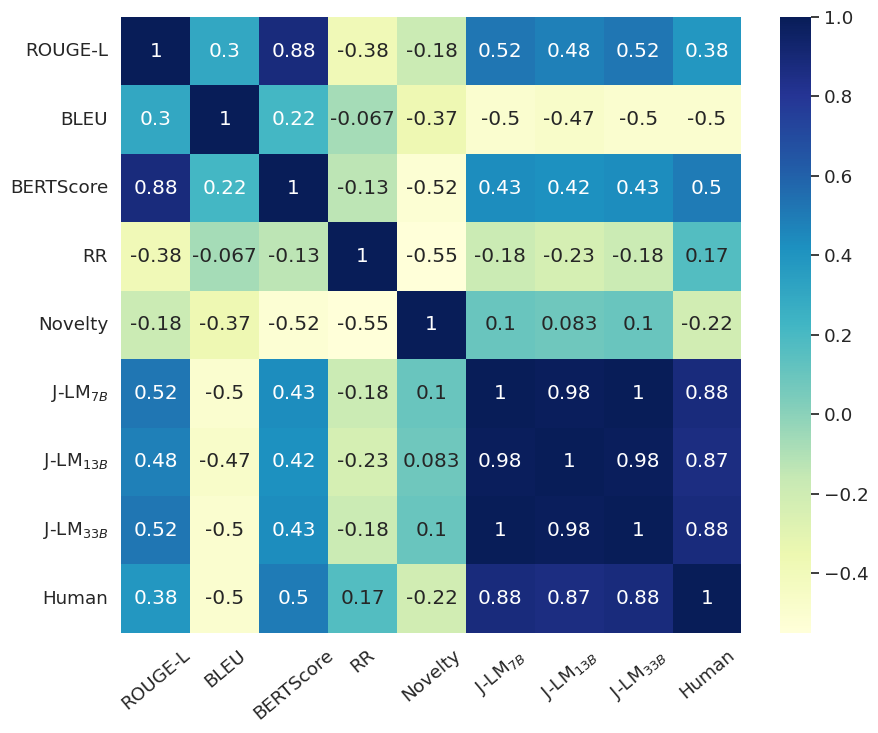

<p align="center">
    <h2 align="center"> A LLM-based Ranking Method for the Evaluation of Automatic Counter-Narrative Generation </h2>


<p align="center">
    <a href="https://github.com/hitz-zentroa/cn-eval/blob/main/LICENSE"></a>
    <a href="https://arxiv.org/abs/2406.15227"></a>
<br>
     <a href="http://www.hitz.eus/"></a>
    <a href="http://www.ixa.eus/?language=en"></a>
    <br>
     <br>
</p>

<p align="justify">

This repository contains the code accompanying our paper, "An LLM-based Ranking Method for the Evaluation of Automatic Counter-Narrative Generation".

In this work, we address the limitations of traditional evaluation metrics for counter-narrative (CN) generation, such as BLEU, ROUGE, and BERTScore. These conventional metrics often overlook a critical factor: the specific hate speech (HS) that the counter-narrative is responding to. Without accounting for this context, it's challenging to truly assess the quality of generated CNs.

To tackle this, we propose a novel automatic evaluation approach. Our method uses a pairwise, tournament-style ranking system to evaluate CNs, relying on JudgeLM—a specialized language model trained to assess text quality. JudgeLM allows us to compare CNs directly without human intervention, transforming the subjective task of CN evaluation into manageable binary classification problems.

For thorough validation, we test our approach on two distinct datasets: CONAN and CONAN-MT, ensuring that our method generalizes well across different corpora.

Below, you can find a visualization of the correlation matrix, which demonstrates the effectiveness of our ranking method in comparison with traditional metrics.
</p>

<p align="center">
<width="50%">
</p>

**Disclaimer**
This repository contains the core Python code used in the accompanying paper, but please note that the specific implementation of the "repetition rate" metric is proprietary and has been excluded from the shared code. The provided scripts outline the overall framework and analysis process, but the actual calculation of the repetition rate is not available in this version.


## Citation
```bibtex
@inproceedings{zubiaga2024llmbasedrankingmethodevaluation,
      title={A LLM-Based Ranking Method for the Evaluation of Automatic Counter-Narrative Generation}, 
      author={Irune Zubiaga and Aitor Soroa and Rodrigo Agerri},
      year={2024},
      booktitle={Findings of EMNLP} 
}
```
